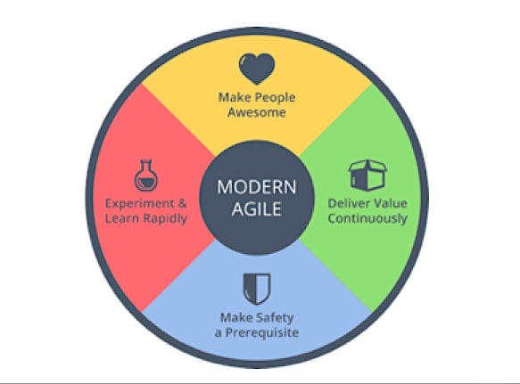

# Table of Contents
#### Main Body:  

1. Overview
2. Agile Transformation
3. Applying Agile Methods and Mindset within the Air Force
4. Agile Architecture
5. Agile Framework
  
#### Appendix A: Key Event Plays  
#### Appendix B: Key Personnel Plays  
#### Appendix C: Key Links  
#### Appendix D: Agile Terminology  
#### Appendix E: Glossary  
